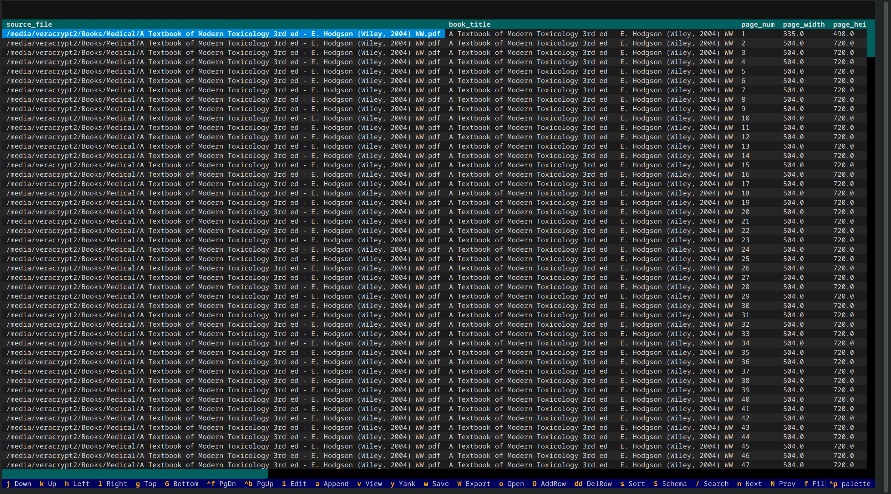
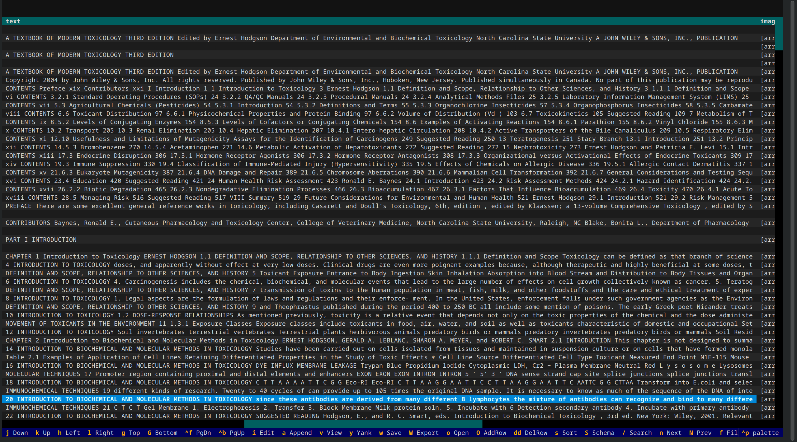
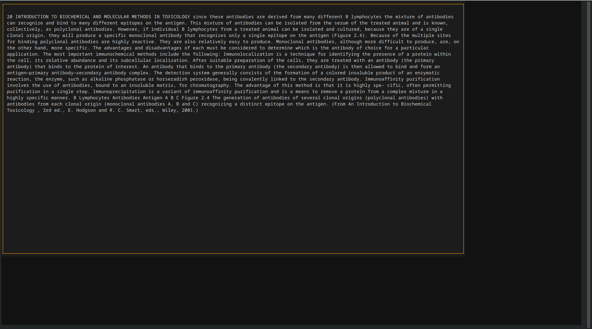
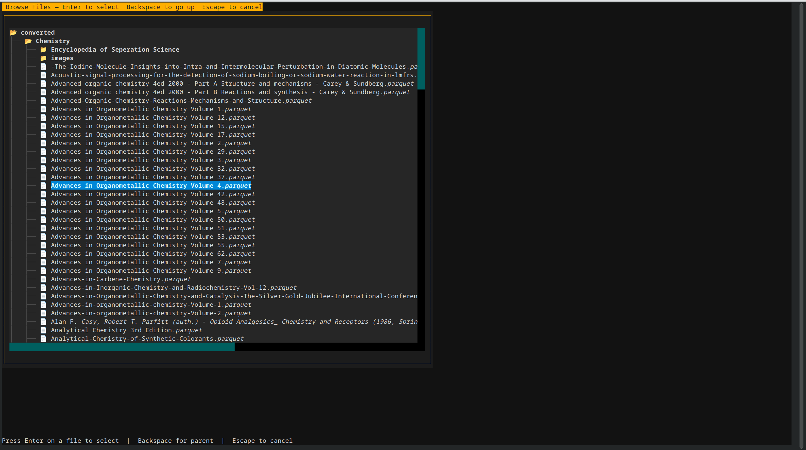

# pqr — Parquet Viewer & Editor

A fast, keyboard-driven terminal application for inspecting, querying, and editing Apache Parquet files. Built on the Textual TUI framework.

<still under development not all options are 100% stable yet>









---

## Quick Start

```bash
# Open a parquet file in the terminal UI
pqr data.parquet

# Print schema without the UI
pqr data.parquet --schema

# Filter, sort, and export as CSV
pqr data.parquet --step "filter:price > 100" --step "sort:column=price" --export

# Run a SQL query
pqr data.parquet --sql "SELECT category, COUNT(*) FROM df GROUP BY category"
```

---

## Installation

Requires Python 3.9+ and the following core dependencies:

```bash
pip install pandas pyarrow textual
```

Optional dependencies:

```bash
# Excel export support
pip install openpyxl

# SQL query mode (press : in the TUI or use --sql)
pip install duckdb

# Clipboard access (yank with y in the TUI)
pip install pyperclip
```

Copy or symlink `pqr` to a directory in your `PATH`, or run it directly:

```bash
python3 pqr data.parquet
```

---

## Usage Modes

### Terminal UI (default)

```bash
pqr data.parquet
```

Opens the full interactive TUI with navigation, editing, search, and all features described below.

```bash
# Browse a directory of .parquet files
pqr data_folder/

# Compare two files side by side
pqr file_v1.parquet file_v2.parquet

# Show recent files (last 10)
pqr
```

### Batch Mode (no TUI)

Add `--step` or `--steps` to run operations and print results to stdout without opening the UI:

```bash
# Print schema
pqr data.parquet --schema

# Filter then print CSV
pqr data.parquet --filter "page_num >= 100"

# Chain multiple steps
pqr data.parquet --step "filter:price > 10" --step "sort:column=price" --export

# SQL query (requires duckdb)
pqr data.parquet --sql "SELECT * FROM df LIMIT 10"

# Run custom Python
pqr data.parquet --step "python:len(df)"

# Pipe to shell commands
pqr data.parquet --step "shell:wc -l"
```

Run `pqr --help` for the full list of CLI options.

---

## Built-in Steps

Steps are the basic units of operation. Each step takes the current data and produces a result. Steps can be chained: the output of one becomes the input of the next.

| Step | Syntax | Description |
|------|--------|-------------|
| `schema` | `schema` | Print schema, column metadata, null counts |
| `yank` | `yank:column=name;row=0` | Copy cell or entire column to clipboard |
| `search` | `search:keyword` | Search text across all columns |
| `filter` | `filter:col > 10` | Filter rows (pandas query syntax) |
| `sort` | `sort:column=name;desc=true` | Sort by column |
| `hide` | `hide:column=name` | Hide a column |
| `sql` | `sql:SELECT * FROM df` | Run DuckDB SQL query |
| `stats` | `stats;column=name` | Show column statistics |
| `delete-row` | `delete-row;row=5` | Delete a row by index |
| `export` | `export:format=json;output=out.json` | Export to CSV, JSON, or Parquet |
| `python` | `python:df['col'].sum()` | Evaluate a Python expression |
| `shell` | `shell:cut -d, -f1` | Pipe CSV data through a shell command |

Steps use `:` to separate the step name from arguments, and `;` to separate multiple arguments:

```bash
# yank row 5 of column "price"
--step "yank:column=price;row=5"

# export to JSON file
--step "export:format=json;output=report.json"
```

### Shorthand flags

Common steps have shorthand flags as shortcuts:

```bash
--schema              # --step schema
--sql "SELECT ..."    # --step sql:SELECT ...
--filter "col > 5"    # --step filter:col > 5
--sort col_name       # --step sort:column=col_name
--yank col_name       # --step yank:column=col_name
--export              # --step export (appended last)
```

---

## Custom Shortcuts

Store reusable step sequences in `~/.config/pqr/shortcuts.toml`:

```toml
[shortcuts.summary]
description = "Print schema and stats"
steps = ["schema", "stats"]

[shortcuts.highvalue]
description = "High-value items sorted by price"
steps = ["filter:price > 100", "sort:column=price;desc=true", "export:format=csv"]

[shortcuts.textpages]
description = "Pages that contain text"
steps = ["python:len(df[df['text'].notna()])"]
```

Use them with `--shortcut`:

```bash
pqr data.parquet --shortcut summary
pqr data.parquet --shortcut highvalue
```

---

## Terminal UI

When opened without `--step`, pqr launches the full interactive terminal UI.

### Navigation

| Key | Action |
|-----|--------|
| `j` / `k` or `↑` / `↓` | Move cursor up/down |
| `h` / `l` or `←` / `→` | Move cursor left/right |
| `g` | Jump to top |
| `G` | Jump to bottom |
| `Ctrl+F` / `PgDn` | Page down |
| `Ctrl+B` / `PgUp` | Page up |

### Editing

| Key | Action |
|-----|--------|
| `i` / `e` | Edit cell value |
| `a` | Append to cell value |
| `Enter` / `Ctrl+J` | Confirm edit |
| `Esc` | Cancel edit |
| `v` | View full cell contents in a popup |
| `y` | Copy cell value to clipboard |
| `O` | Add a new empty row |
| `dd` | Mark row for deletion (applied on save) |

### Data Operations

| Key | Action |
|-----|--------|
| `s` | Sort current column (toggles ascending/descending) |
| `H` | Hide or show current column |
| `x` | Show column statistics |
| `/` | Search across all columns |
| `n` / `N` | Next / previous search match |
| `f` | Toggle filter bar (pandas query syntax) |
| `:` | SQL query prompt (requires duckdb) |

### File & Export

| Key | Action |
|-----|--------|
| `o` / `Ctrl+O` | Open file browser |
| `w` | Save edits to `<filename>_edited.parquet` |
| `W` | Export as CSV, Excel, or Parquet |
| `S` | View Parquet schema |

### Tabs

| Key | Action |
|-----|--------|
| `Tab` / `gt` | Next tab |
| `Shift+Tab` / `gT` | Previous tab |

### Other

| Key | Action |
|-----|--------|
| `q` | Quit (warns if unsaved edits exist) |

---

## How It Works

1. Loads the Parquet file via `pyarrow` into a `pandas.DataFrame`. Files over 5,000 rows use lazy row-group loading for efficient memory usage.
2. Renders data in a `textual` `DataTable` with cursor tracking and zebra-striped rows.
3. Cell edits are captured in an overlay screen with type-aware conversion back to the original Parquet type.
4. The **step pipeline** processes operations sequentially: each step receives the current data state and produces a new one.
5. On save (`w`), marked rows are dropped and edited cells are type-converted before writing to a new `<filename>_edited.parquet` file.
6. A status bar shows row counts, edit count, and live column statistics for numeric types.

---

## License

MIT License. Copyright (c) 2026 Matthew Abbott.

## Author

**Matthew Abbott** — mattbachg@gmail.com

